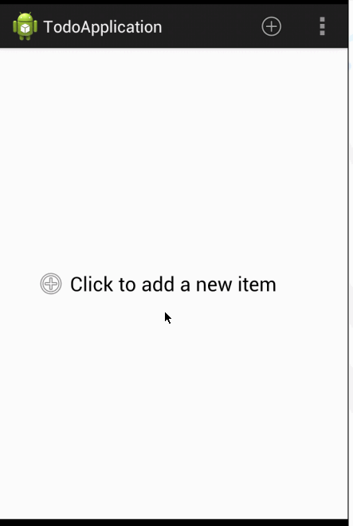

TO-DO Application for Android
========

This is a quick and dirty implementation of the TO-DO application. 

####Total time spent: 5 Hours

####Notable implementation details:
  * Create a To-Do item by pressing the add button in ActionBar. 
  * Set a due date and priority for the item.
  * Long press listview row to delete item.
  * click row to edit item. Use reset button to clear all fields.
  * Empty view for list is clickable anywhere to launch new "Add Item" Dialog.
  * Re-use DialogFragment to "Add Item" and "Edit Item".
  * Use custom array adapter for ListView to display due date and priority(shown as image).
  * Due date are displayed in days difference from current date. Due dates can only be in future.
  * The priorities for each items are Standard, High(icon: star_on) and Low(icon: star_off).

####Demo:
